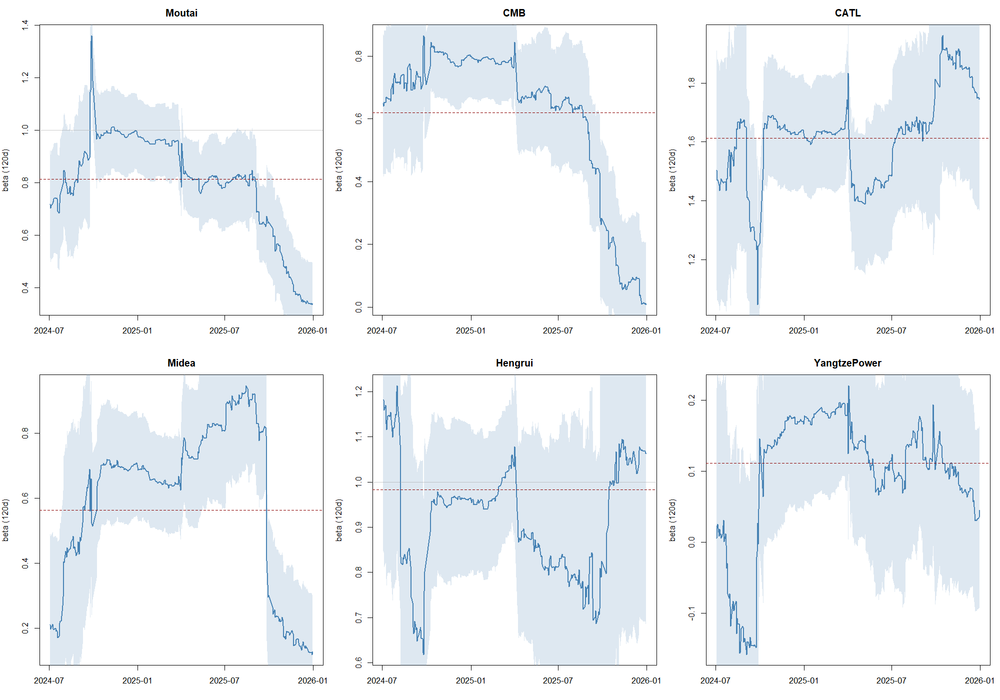
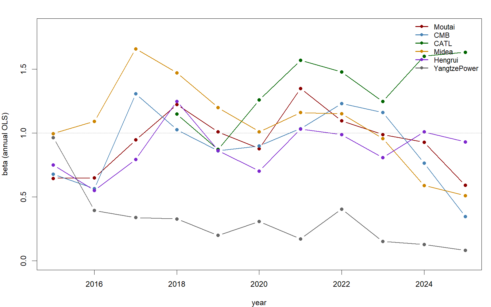

# CAPM模型在A股市场的适用性：六大行业龙头的实证检验与稳健性分析


## English Summary

Single-factor CAPM tests on six A-share industry leaders (Kweichow Moutai, China Merchants Bank, CATL, Midea, Hengrui, Yangtze Power) against the CSI 300 index, 2024–2025 daily data (~485 observations per stock).

**Pipeline**: Sina hfq prices → log returns → OLS market regressions → HC3 & Newey-West robust inference (data-driven bandwidths, recorded per stock and frequency) → 120-day rolling betas with 95% bands → yearly subsamples + event-window sensitivity → 10-year (2015–2025) extended robustness appendix.

**Engineering**: every number in this README is auto-generated from committed CSV fixtures (SHA-256 manifest in `data/meta/`); CI reruns the full R pipeline on every push and asserts machine-precision agreement; all estimates independently reproduced in Python/statsmodels (agreement <1e-14).

**Headline**: betas range from 1.61 (CATL, aggressive) to 0.11 (Yangtze Power, near-decoupled from the market); five of six alphas are indistinguishable from zero under all standard-error variants; Moutai's negative alpha is the exception — significant under all variants at weekly frequency (p≈0.029-0.039) and under HAC at daily frequency (p≈0.023), a criterion sensitivity we report rather than resolve; residuals are strongly leptokurtic (Jarque–Bera p < 0.001 for all six).

---

## 核心结论

CAPM对A股龙头**方向上成立、程度上分化**：六只β在OLS与NW下全部显著为正（HC3下长江电力p≈0.068，见稳健推断表），但大盘对长江电力的解释力只有1.9%——单因子模型覆盖不了所有商业模式；α五只无法拒绝为0，茅台是唯一例外：周频三种标准误下均显著为负（p≈0.029-0.039），日频仅HAC显著（p≈0.023），两种结果并列展示；β本身随时间明显漂移，静态点估计必须配稳健推断和稳定性检验才可信。

## 研究问题

1. CAPM能否解释A股龙头企业的收益变动？（β显著性、R²解释力度）
2. 模型适用性在不同行业间是否存在系统性差异？
3. 龙头股是否存在可稳定获取的超额收益α？β在时间上稳定吗？

## 数据与口径

| 项目 | 设定 |
|---|---|
| 个股 | 贵州茅台600519 / 招商银行600036 / 宁德时代300750 / 美的集团000333 / 恒瑞医药600276 / 长江电力600900 |
| 市场基准 | 沪深300指数（价格指数） |
| 价格基准 | **后复权（hfq）**，主源新浪（见设计决策1、2） |
| 收益率 | 日对数收益 rₜ=ln(Pₜ/Pₜ₋₁)；周频=周内日收益之和 |
| 样本区间 | 2024-01-02 ~ 2025-12-31，日频n=485，周频n=104 |
| 对齐方式 | 以指数交易日历为主干按日期键对齐；停牌不前向填充（本样本无停牌缺失） |
| 无风险利率 | 主回归取Rf≈0（日度约0.0055% vs 个股日波动>0.8%；常数Rf下β不受影响，仅α平移，附录实测Δβ<1e-12，机器精度量级，属浮点尾数噪声） |
| 极端值 | 涨跌停日保留，肥尾交由稳健推断处理 |
| 数据来源 | AkShare接口抓取，抓取日期与SHA-256清单见`data/meta/`，数据已随仓库提交、无需联网即可复现分析 |

## 方法

单因子时间序列回归：Rᵢ,ₜ = αᵢ + βᵢ·Rₘ,ₜ + εᵢ

**适用性判据**（研究约定，非学界统一标准；结论以连续量呈现为主，二分标签仅作概括）：β显著为正、R²度量解释力度、α是否可拒绝为0。

**推断**：同时报告OLS经典、HC3、Newey-West（Bartlett核，带宽由`bwNeweyWest()`按数据实测：宁德时代 13 / 恒瑞医药 3 / 贵州茅台 17 / 招商银行 11 / 美的集团 9 / 长江电力 13；周频另行实测，互不复用）三套标准误。

## 核心结果

### 主回归（日频，2024-2025，经典OLS）

| 股票 | n | α | p(α) | β | p(β) | R² | JB p |
|---|---|---|---|---|---|---|---|
| 宁德时代 | 485 | 0.000783 | 0.3407 | 1.6126 | 3.73e-79 | 52.1% | <1e-300 |
| 恒瑞医药 | 485 | -0.000022 | 0.9772 | 0.9830 | 6.74e-42 | 31.7% | <1e-300 |
| 贵州茅台 | 485 | -0.000818 | 0.0940 | 0.8122 | 1.46e-62 | 43.9% | <1e-300 |
| 招商银行 | 485 | 0.000679 | 0.1985 | 0.6204 | 2.00e-36 | 28.1% | 7.88e-12 |
| 美的集团 | 485 | 0.000590 | 0.3358 | 0.5621 | 3.61e-24 | 19.2% | 0.0002 |
| 长江电力 | 485 | 0.000367 | 0.3918 | 0.1113 | 0.0025 | 1.9% | <1e-300 |

### 稳健推断（日频，β标准误与p值三套对照）

| 股票 | β | SE(OLS) | SE(HC3) | SE(NW) | p(OLS) | p(HC3) | p(NW) |
|---|---|---|---|---|---|---|---|
| 宁德时代 | 1.6126 | 0.0704 | 0.1184 | 0.1031 | 3.73e-79 | 5.85e-36 | 6.80e-45 |
| 恒瑞医药 | 0.9830 | 0.0657 | 0.0683 | 0.0699 | 6.74e-42 | 2.47e-39 | 6.24e-38 |
| 贵州茅台 | 0.8122 | 0.0418 | 0.0888 | 0.0818 | 1.46e-62 | 1.69e-18 | 2.94e-21 |
| 招商银行 | 0.6204 | 0.0452 | 0.0629 | 0.0854 | 2.00e-36 | 5.01e-21 | 1.54e-12 |
| 美的集团 | 0.5621 | 0.0525 | 0.0856 | 0.0951 | 3.61e-24 | 1.35e-10 | 6.53e-09 |
| 长江电力 | 0.1113 | 0.0367 | 0.0608 | 0.0396 | 0.0025 | 0.0677 | 0.0051 |

> 波动聚集与异方差是真实存在的：稳健SE为OLS的1.0-2.1倍、多数在1.4倍以上（statsmodels跨语言复核确认非实现误差）。长江电力在HC3下β的p值≈0.068，属边缘显著，两种推断结果均列入下方α表。

| 股票 | α(日) | p(OLS) | p(HC3) | p(NW) | p(NW·周频) |
|---|---|---|---|---|---|
| 宁德时代 | 0.000783 | 0.3407 | 0.3341 | 0.2571 | 0.1706 |
| 恒瑞医药 | -0.000022 | 0.9772 | 0.9772 | 0.9768 | 0.9973 |
| 贵州茅台 | -0.000818 | 0.0940 | 0.0859 | 0.0228 | 0.0291 |
| 招商银行 | 0.000679 | 0.1985 | 0.2009 | 0.1792 | 0.2192 |
| 美的集团 | 0.000590 | 0.3358 | 0.3447 | 0.2789 | 0.1414 |
| 长江电力 | 0.000367 | 0.3918 | 0.3914 | 0.3842 | 0.4132 |

> α显著性（三种标准误×两个频率）：五只股票均无法拒绝α=0。唯一例外是贵州茅台的负α——周频下三种标准误全部显著（p≈0.029-0.039），日频下仅Newey-West显著（p≈0.023）、OLS/HC3不显著（p≈0.086-0.094）。两种结果并列，不替读者选择。

### 周频对照（非同步交易的稳健性检验：R²升降双向都可能出现）

| 股票 | β(日) | β(周) | p_NW(日) | p_NW(周) | R²(日) | R²(周) |
|---|---|---|---|---|---|---|
| 宁德时代 | 1.613 | 1.274 | 6.80e-45 | 3.14e-21 | 52.1% | 46.5% |
| 恒瑞医药 | 0.983 | 0.944 | 6.24e-38 | 1.28e-09 | 31.7% | 29.8% |
| 贵州茅台 | 0.812 | 1.129 | 2.94e-21 | 1.01e-06 | 43.9% | 60.9% |
| 招商银行 | 0.620 | 0.689 | 1.54e-12 | 1.19e-09 | 28.1% | 36.1% |
| 美的集团 | 0.562 | 0.402 | 6.53e-09 | 0.0003 | 19.2% | 14.5% |
| 长江电力 | 0.111 | 0.147 | 0.0051 | 0.0351 | 1.9% | 3.8% |

### β随时间漂移：滚动窗口与分年



| 股票 | 2024 β (p) | 2025 β (p) |
|---|---|---|
| 宁德时代 | 1.602 (5.31e-45) | 1.632 (5.77e-34) |
| 恒瑞医药 | 1.010 (4.89e-30) | 0.931 (8.44e-14) |
| 贵州茅台 | 0.929 (2.81e-40) | 0.591 (1.86e-19) |
| 招商银行 | 0.765 (2.55e-31) | 0.346 (3.29e-06) |
| 美的集团 | 0.590 (6.18e-15) | 0.510 (1.10e-09) |
| 长江电力 | 0.128 (0.0163) | 0.081 (0.1069) |

924行情（2024-09-24政策组合拳）前后交互项F检验：六只p值均>0.05（长江电力p=0.053接近阈值，该结论对其偏脆弱），本样本内不构成结构断点；窗口较短，仅作敏感性检验。

### 十年扩展稳健性（2015-2025，同源数据）



| 时期 | 宁德时代 | 恒瑞医药 | 贵州茅台 | 招商银行 | 美的集团 | 长江电力 |
|---|---|---|---|---|---|---|
| 2015-2017 | — | 0.71 | 0.66 | 0.68 | 1.05 | 0.64 |
| 2018-2020 | 1.09 | 0.93 | 1.03 | 0.93 | 1.20 | 0.28 |
| 2021-2023 | 1.47 | 0.97 | 1.17 | 1.15 | 1.12 | 0.27 |
| 2024-2025 | 1.61 | 0.98 | 0.81 | 0.62 | 0.56 | 0.11 |

十年视角的关键事实：长江电力11个年度β中9个低于0.4，说明"类债化"是结构特征而非本样本期的偶然；茅台、美的、招行的β在2024-2025明显走低，说明"龙头β"本身是时变的，任何静态点估计都应配稳定性检验。

## 设计决策与踩过的坑

1. **数据源事故**：最初用东方财富`stock_zh_a_hist`的hfq数据，三源交叉验证（东财×新浪×腾讯）发现其**非除权日的日收益也被系统性压缩**（例：2024-09-24招行真实涨幅+5.40%（新浪、腾讯一致），东财hfq算出+3.95%；485天中471天|Δr|>1bp），不满足"复权因子在事件间恒定"的基本性质。全部主源切换为新浪`stock_zh_a_daily(hfq)`并重建结果。上述对照可用`evidence/incident_check.py`联网复跑核验（输出`evidence/incident_check.csv`），事件记录存档于`data/meta/fetch_metadata.json`。原计划的yfinance镜像因Yahoo持续限流（HTTP 429）未建成；个股层面的全量第三方校验未做，仅完成招行样本的三源对照，已记为待办。
2. **选hfq不选qfq**：后复权以上市日为锚，历史窗口内价格不随未来分红修订，fixture更稳定。
3. **对数收益**：时间可加（周收益=日收益求和）；代价是组合加总需用简单收益（列入局限）。
4. **Rf≈0**：日频无风险利率与股票波动差两个数量级，常数Rf只平移α不改β（附录实测机器精度级不变）；时变Rf序列因接口不可用未做，已记录。
5. **停牌处理**：日历主干+不前向填充——填零收益会伪造低波动、污染NW带宽估计。
6. **跨语言复核**：R的β/α/HC3/NW全部用statsmodels重算，30项断言最大偏差为机器精度级（<1e-14）（`tests/crosscheck.py`）。
7. **差分错位bug**：R逻辑索引赋值`r[ok] <- diff(x[ok])`会让整列收益错位一天（diff少一行触发recycling），修复为按位置索引赋值，并用三个手工抽查点验证。

## 已知局限

- 样本为6只行业龙头（选题设计如此），不覆盖中小盘；结论不外推至全市场
- 单因子设定，未纳入规模/价值/盈利等Fama-French因子——对美的、长电这类CAPM解释力偏弱的样本，多因子可能显著提升解释力，留作后续
- 主窗口仅两年，时期偏差以2015-2025扩展附录部分缓解，仍非全周期检验
- 日频单因子回归受非同步交易影响（可能抬高R²），以周频对照部分回应，未做Dimson修正
- 多重检验未做形式校正：按单股（6股各3种SE）阈值0.05/6≈0.0083，六只β均显著；按全部36次检验的严格阈值0.05/36≈0.0014，长江电力（NW p=0.0051）不再显著，其余五只不受影响
- 沪深300全收益指数（H00300）敏感性因数据接口不可用未做，价格指数口径对α的影响留待补验

## 复现

```bash
# 分析（离线, 数据已提交, 无需下载）
Rscript -e "renv::restore()"   # 首次运行: 按renv.lock装齐R依赖
Rscript src/R/01_clean.R      # 收益率矩阵
Rscript src/R/02_base.R       # 主回归 + JB + 诊断图
Rscript src/R/03_robust.R     # HC3/Newey-West + rf附录
Rscript src/R/04_rolling.R    # 滚动β + 分年子样本 + 924敏感性
Rscript src/R/05_extended.R   # 十年扩展稳健性

# 跨语言复核（可选, 需Python; 建议干净venv, 版本与CI一致; 其他较新版本通常亦可）
python -m venv .venv && pip install -r requirements.txt
python tests/crosscheck.py   # 30项断言, 退出码0=通过

# 数据刷新（联网, 手动; 会更新fixture与SHA-256清单）
python src/py/fetch_data.py
```

环境：R 4.4.1（`renv.lock`锁包版本）；Python ≥3.11（`requirements.txt`）。README中全部数字由`src/py/gen_readme.py`从`results/tables/`自动生成，与仓库内表格逐位一致。

复现范围：分析链字节级可复现；`fetch_data.py`为一次性存档流程（元数据含手工标注字段，见`data/meta/fetch_metadata.json`的`manual_annotations`）；数据源事故对照经`evidence/incident_check.py`联网复跑核验。

## 目录结构

```
├── data/raw/          六股+指数 日收盘价CSV（fixture, SHA-256见meta）
├── data/raw_ext/      2015-2025十年OHLC（扩展附录用）
├── data/processed/    日/周收益率矩阵
├── data/meta/         抓取元数据 + SHA-256清单 + 数据源事故记录
├── evidence/          数据源事故的联网复跑核验脚本与输出
├── src/py/            取数 / README生成脚本
├── tests/             跨语言复核 + 数值回归断言
├── docs/              README模板
├── src/R/             01~05 分析流水线
├── results/tables/    全部机器精度结果表（README数字来源）
└── results/figures/   诊断图 / 滚动β面板 / 年度β面板
```

## 数据声明

行情数据经AkShare抓取（新浪/腾讯/东财公开接口），版权归原数据源所有，本仓库仅存档研究复现所需的最小价格序列。

## License

MIT — Jiahan Wang, 2026
